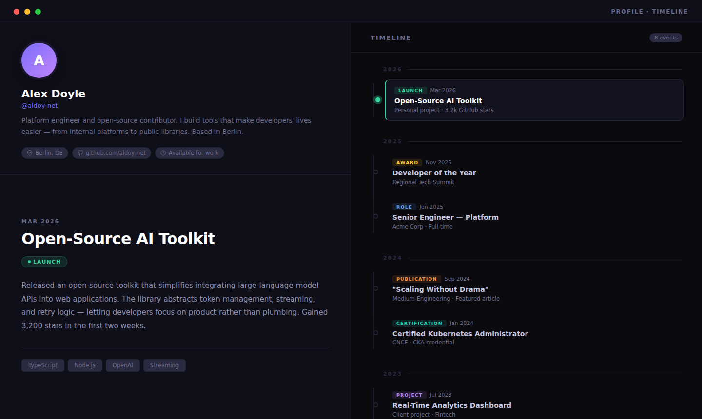

# Profile · Split-Screen Timeline

A single-file PHP landing page presenting a developer profile alongside a scrollable timeline of events and achievements.



## Layout

| Panel | Content |
|-------|---------|
| **Left — top** | Profile hero: avatar, name, handle, bio, and info pills |
| **Left — bottom** | Detail view for the selected event (title, type badge, description, tags) |
| **Right** | Scrollable timeline grouped by year with colour-coded event-type badges |

Clicking any timeline item highlights it and fades in its details on the left.

## Event types & colours

| Type | Colour |
|------|--------|
| Launch | Emerald |
| Award | Amber |
| Role | Blue |
| Publication | Orange |
| Certification | Teal |
| Project | Purple |
| Talk | Pink |

## Usage

Serve with PHP's built-in server:

```bash
php -S localhost:8080
```

Then open `http://localhost:8080/index.php`.

## Customising

Edit the `events` array near the bottom of `index.php`:

```js
{
    id:          1,           // unique integer
    year:        2026,        // used for year grouping
    date:        "Mar 2026",  // displayed label
    type:        "Launch",    // controls badge colour (see table above)
    title:       "…",
    subtitle:    "…",         // shown under title in the timeline
    description: "…",         // long-form text in the detail panel
    tags:        ["Tag1", "Tag2"]
}
```

To update profile details (name, bio, pills), edit the `#profile` block in the HTML section of `index.php`.
