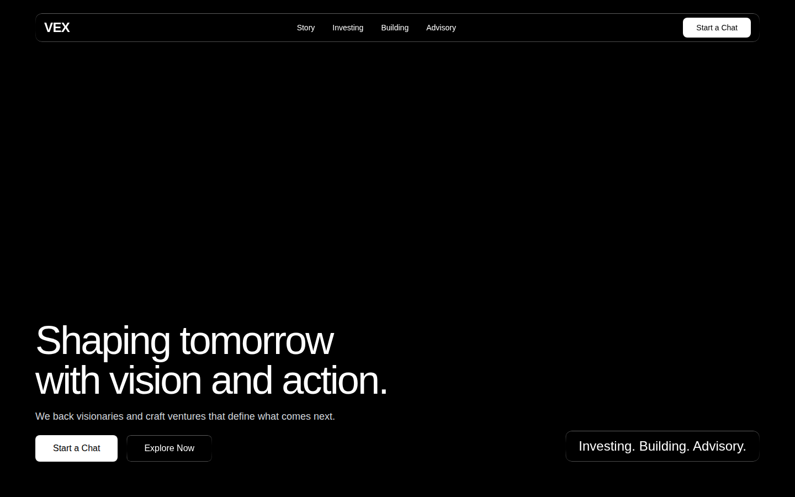
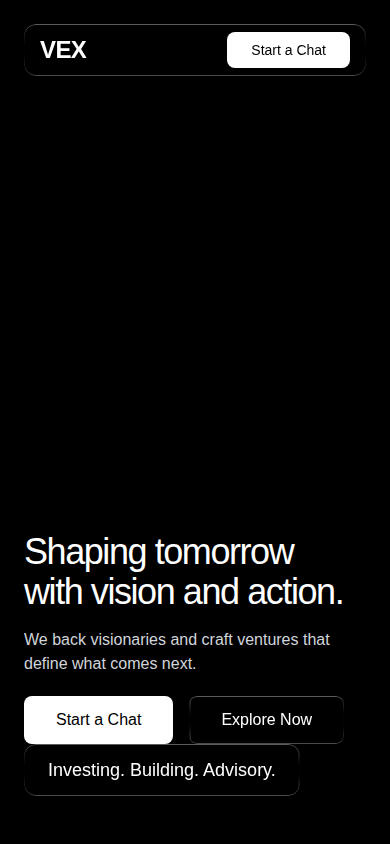

# Profile

This repository contains two independent front-end demos:

1. **Split-Screen Timeline** — a single-file PHP landing page (below)
2. **VEX Hero Section** — a React + Vite app (further down)

**Live:** the VEX Hero Section is deployed to GitHub Pages on every push to the default branch: **https://aldoy-net.github.io/.profile/**

The Split-Screen Timeline requires a PHP runtime and is not deployed to Pages (static hosting only) — run it locally per the instructions below.

## Split-Screen Timeline

A single-file PHP landing page presenting a developer profile alongside a scrollable timeline of events and achievements.


### Layout

| Panel | Content |
|-------|---------|
| **Left — top** | Profile hero: avatar, name, handle, bio, and info pills |
| **Left — bottom** | Detail view for the selected event (title, type badge, description, tags) |
| **Right** | Scrollable timeline grouped by year with colour-coded event-type badges |

Clicking any timeline item highlights it and fades in its details on the left.

### Event types & colours

| Type | Colour |
|------|--------|
| Launch | Emerald |
| Award | Amber |
| Role | Blue |
| Publication | Orange |
| Certification | Teal |
| Project | Purple |
| Talk | Pink |

### Usage

Serve with PHP's built-in server:

```bash
php -S localhost:8080
```

Then open `http://localhost:8080/index.php`.

### Customising

Edit the `events` array near the bottom of `index.php`:

```js
{
    id:          1,           // unique integer
    year:        2026,        // used for year grouping
    date:        "Mar 2026",  // displayed label
    type:        "Launch",    // controls badge colour (see table above)
    title:       "…",
    subtitle:    "…",         // shown under title in the timeline
    description: "…",         // long-form text in the detail panel
    tags:        ["Tag1", "Tag2"]
}
```

To update profile details (name, bio, pills), edit the `#profile` block in the HTML section of `index.php`.

## VEX Hero Section (React + Vite)

A separate React + TypeScript + Tailwind CSS + Vite app (`src/`) implementing a full-screen video hero section with a liquid-glass navbar and staggered entrance animations.

| Desktop | Mobile |
|---------|--------|
|  |  |

Highlights:

- Full-screen autoplay/loop/muted background video, no dark overlay
- `.liquid-glass` navbar and CTA styling with a gradient-border mask effect
- `AnimatedHeading` — character-by-character entrance animation
- `FadeIn` — staggered opacity fade-ins for the subheading, buttons, and tag card
- Google Font `Inter` wired through `index.html` and `tailwind.config.js`

### Usage

```bash
npm install
npm run dev
```

Then open the printed local URL (defaults to `http://localhost:5173`).

```bash
npm run build   # type-check + production build
```
